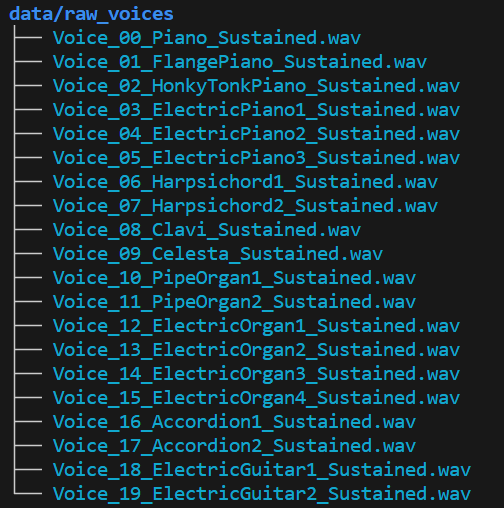

# Machine Learning with Audio Tones

This is a toy project to explore Machine Learning, using audio tones.

# Getting Started

## Check out the project

Check out the project from GitHub:

```bash
git clone git@github.com:johnbhurst/ml_tones.git
```

## Set up your Python Virtual Environment

After cloning the project, create a Python virtual environment and install the required packages:

```bash
cd ml_tones
python3 -m venv venv
source venv/bin/activate
pip install --upgrade pip
pip install -r requirements.txt
```

## Pull the data using DVC

The data is stored in a Google Cloud Storage bucket. The [DVC](https://dvc.org/) tool is installed in the virtual environment. Use DVC to pull the data from the bucket:

```bash
dvc pull
```

(The raw WAV data total about 1GB, so this may take a while.)

The raw WAV data are now in the [data/raw_voices](`data/raw_voices`) directory:



## Run the pipeline using DVC

The pipeline is defined in the `dvc.yaml` file. Run the pipeline using DVC:

```bash
dvc repro
```
